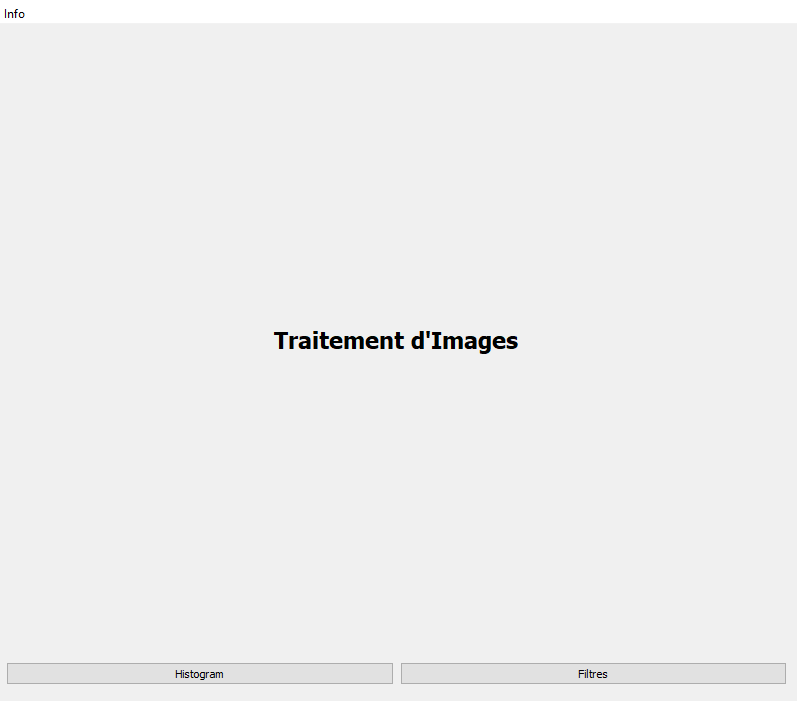
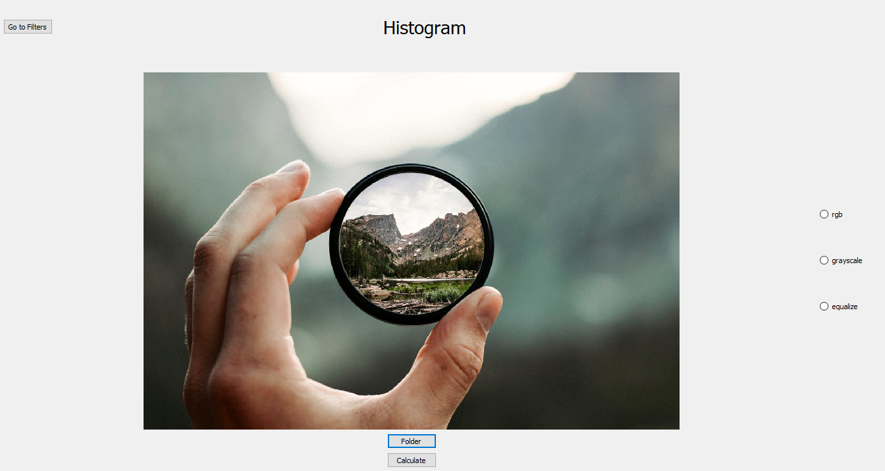
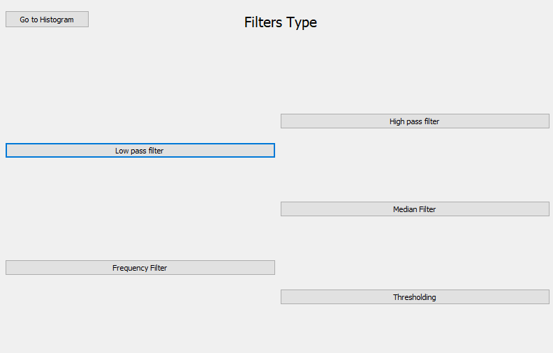
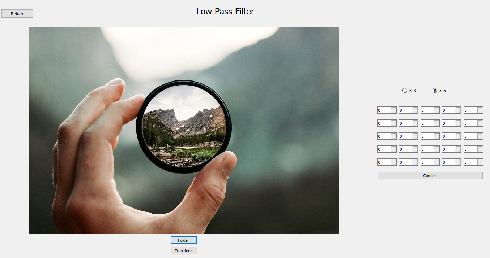

 
       Image Processing Learning Utility
 

🔴 IMPORTANT 🔴 

 Before Building 

 
*******************************************************************************************************************

Please make sure that you have :

 - Opencv (I used 4.5.2)
 - Qt (I used 5.12)
 - Boost (I used 1.77)
 
 installed on the computer and configured to be detected when building the project. (If you use windows make sure to configure your 
 libraries directories and binaries directories in your environment variable path to make things easy for you !!)

 
********************************************************************************************************************

 
    

 
********************************************************************************************************************

 
    

 
********************************************************************************************************************

 
    

 
********************************************************************************************************************

 
    

 
********************************************************************************************************************

